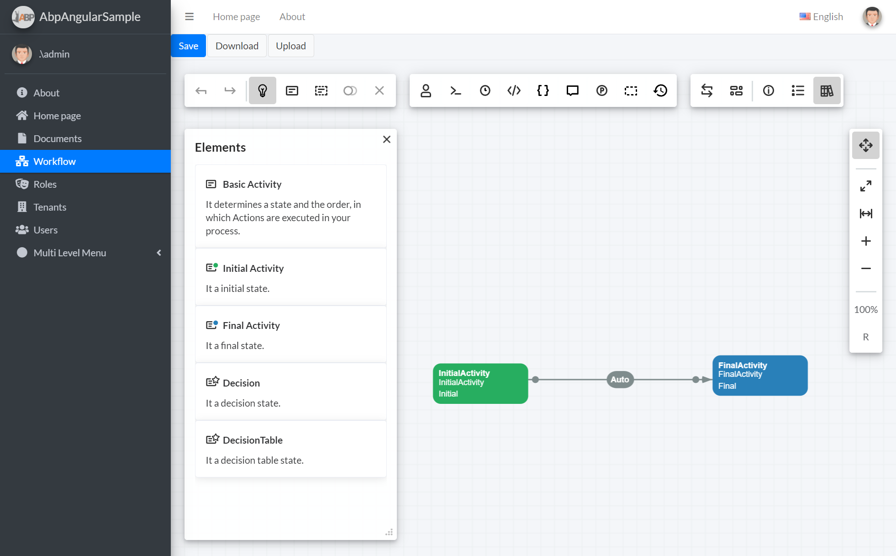
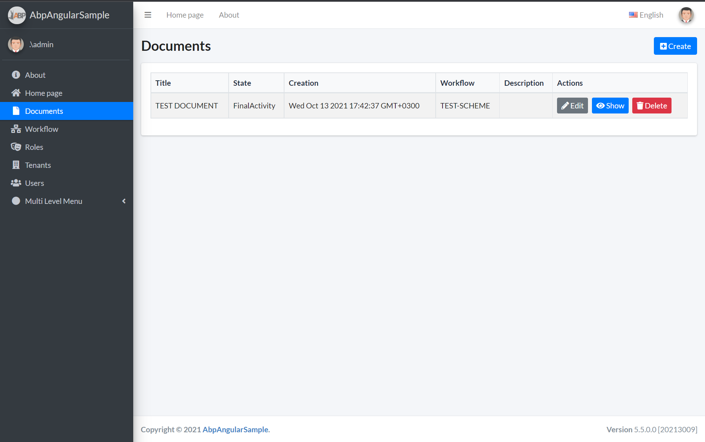

# ASP.NET Boilerplate Angular version & WorkflowEngine

# Get Started

## Download

Create & download your project from https://aspnetboilerplate.com/Templates

### Asp.Net Core solution set up

You can find all the changes needed for the backend part of the application in the following [commit](https://github.com/optimajet/WorkflowEngine.NET/commit/fe1671d68e5c1aca3a1e9f391529e6079498df09). All code changes are highlighted with the comment *WorkflowEngineSampleCode*. You can use the *WorkflowEngineSampleCode* keyword at the global project search to find all the required changes.

To make the same sample like this one, you need to follow these steps:

- Add references to the following  NuGet packages to the AbpAngularSample.Application project: WorkflowEngine.NetCore-Core, WorkflowEngine.NetCore-ProviderForMSSQL
- Add *WorkflowRuntimeManager* and *ActionProvider* (see AbpAngularSample.Application/Workflow folder)
- Register services *IWorkflowActionProvider* and *WorkflowRuntime* (see AbpAngularSample.Web.Host/Startup/Startup.cs)
- Add Document entity (see AbpAngularSample.Core/Documents)
- Set up EF Core context and migrate to add *AppDocuments* table (see AbpAngularSample.EntityFrameworkCore/YourSolutionNameDbContext.cs)
- Add *DocumentAppService* and *WorkflowSchemeAppService* with all required Dto (see AbpAngularSample.Application/Documents and AbpAngularSample.Application/WorkflowSchemes)
- Add *DesignerController* (see AbpAngularSample.Web.Host/Controllers)

Done!

## Angular solution set up

You can find all the changes needed for the backend part of the application in the following [commit](https://github.com/optimajet/WorkflowEngine.NET/commit/ede24d4b02641afa86970c963bc946880fcd8eff).  All code changes are highlighted with the comment *WorkflowEngineSampleCode*. Same as at the backend part.

To make the same sample like this one, you need to follow these steps:

- Add Workflow Designer Angular package and JQuery

```shell
npm i @optimajet/workflow-designer-angular jquery
```

- Implement *WorkflowSchemeServiceProxy* and *DocumentServiceProxy* (see @shared/service-proxies/)
- Implement Angular components for documents and workflow  (see @app/documents и @app/workflow)
- Add components and modules implemented earlier into *app.module.ts* (see @app/app.module.ts)
- Add endpoints to routing (see @app/app-routing.module.ts)
- Add menu sections for new components (see @app/layout/sidebar-menu.component.ts)
- Add the Workflow Designer styles into the *core.less* (see @shared/core.less)

Done!

# Screenshots

#### Workflow Designer



#### Documents



# Documentation

* [ASP.NET Core MVC & jQuery version.](https://aspnetboilerplate.com/Pages/Documents/Zero/Startup-Template-Core)
* [ASP.NET Core & Angular  version.](https://aspnetboilerplate.com/Pages/Documents/Zero/Startup-Template-Angular)
* [Workflow Engine](https://workflowengine.io/documentation/)
* [Workflow Designer Angular](https://www.npmjs.com/package/@optimajet/workflow-designer-angular)

# License

[MIT](LICENSE).
