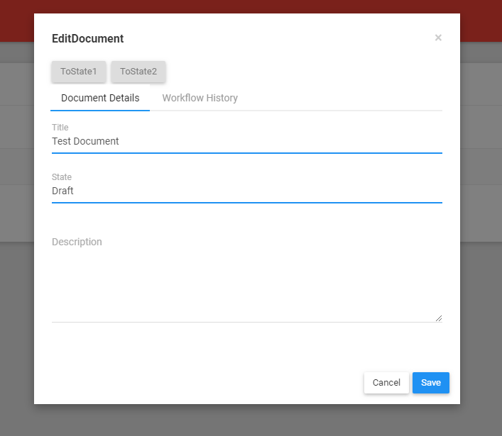

# Introduction

This is a sample of integration of [WorkflowEngine](https://workflowengine.io) into an Angular project based on [ASP.NET Core & Angular](https://aspnetboilerplate.com/Pages/Documents/Zero/Startup-Template-Angular).

# How to run

Follow the instruction: https://aspnetboilerplate.com/Pages/Documents/Zero/Startup-Template-Angular

Here you can create workflow schemes and using them in Document objects.
All changes, which we added in the original Boilerplate template, have been marked the comment: **WorkflowEngineSampleCode**. You find them easily.

# Screenshots

#### Workflow Designer Page

#### Document creation and choosing workflow

#### Document with workflow buttons

#### Document workflow history

# Documentation

* [ASP.NET Core & Angular  version.](https://aspnetboilerplate.com/Pages/Documents/Zero/Startup-Template-Angular)
* [WorkflowEngine](https://workflowengine.io/documentation/)
