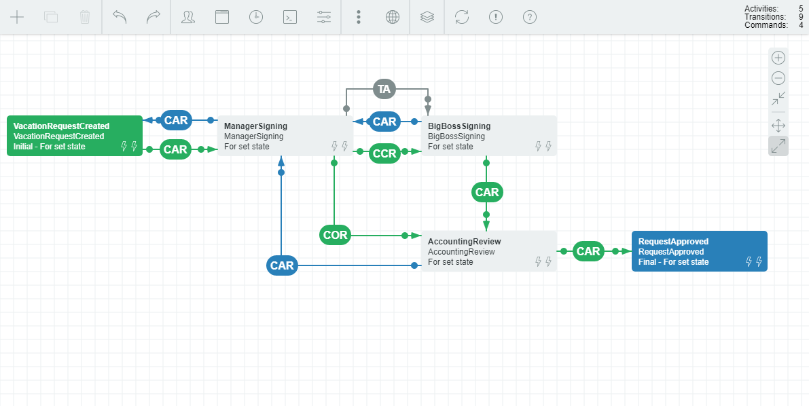

WorkflowEngine.NET
==================

WorkflowEngine.NET - component that adds workflow in your application. It can be fully integrated into your application, or be in the form of a specific service (such as a web service).

<h2>Features:</h2>
<ul>
<li>Process scheme generation in runtime</li>
<li>Designer of process scheme</li>
<li>Changing process scheme in runtime is possible</li>
<li>Pre-execution of process (executing of a process from initial activity to final activity without changing state) </li>
<li>Simple version control and upgrade of process scheme</li>
<li>Serialization and saving of parameters on demand</li>
<li>Support SQL/NoSQL databases</li>
</ul>

<h2>Workflow Engine NET includes a html5 designer:</h2>

<h2>Samples:</h2>

<b>1. Samples/MSSQL - Sample for MS SQL Server</b>

Open solution: Samples\MSSQL\WF.Sample.sln 
Check connection string in WF.Sample\Configuration\ConnectionString.config. 
You can restore DB\db.bak to MS SQL Server or execute scripts. 
The order of execution of scripts:
<ul>
<li>DB\CreatePersistenceObjects.sql (For MS SQL Server) or DB\CreatePersistenceObjectsForAzureSQL.sql (For AzureSQL)</li>
<li>DB\CreateObjects.sql</li>
<li>DB\FillData.sql</li>
</ul>

<b>2. Samples/MongoDB - Sample for MongoDB</b>

Open solution: Samples\MongoDB\Mongo.Sample.sln 
Check connection string in Configuration\AppSettings.config 
&lt;add key="Url" value="mongodb://localhost:27017"/&gt; 
&lt;add key="Database" value="WorkflowEngineNET"/&gt;  

When you first start the application on an empty database, click on button "Generate data" (at the top right of this page)

<b>3. Samples/RavenDB - Sample for RavenDB</b>
Open solution: Samples\RavenDB\RavenDB.Sample.sln 
Check connection string in Configuration\AppSettings.config 
&lt;add key="Url" value="http://localhost:8090/"/&gt; 
&lt;add key="Database" value="WorkflowEngineNET"/&gt;  
When you first start the application on an empty database, click on button "Generate data" (at the top right of this page)

<b>Official web site</b> - <a href="https://workflowengine.io">https://workflowengine.io</a> 
<b>Documentation</b> - <a href="https://workflowengine.io/documentation/">https://workflowengine.io/documentation/</a> 
<b>Designer</b> - <a href="https://workflowengine.io/demo/designer">https://workflowengine.io/demo/designer</a> 
<b>Demo</b> - <a href="https://workflowengine.io/demo/">https://workflowengine.io/demo/</a> 
For technical questions, please contact <a href="mailto:wf@optimajet.com?subject=Question from github">wf@optimajet.com</a> 
For commercial use, please contact <a href="mailto:sales@optimajet.com?subject=Question from github">sales@optimajet.com</a> 

<b>Free limits:</b>
<ul>
<li>Activity: 15</li>
<li>Transition: 25</li>
<li>Command: 5</li>
<li>Schema: 1</li>
<li>Thread: 1</li>
</ul>
