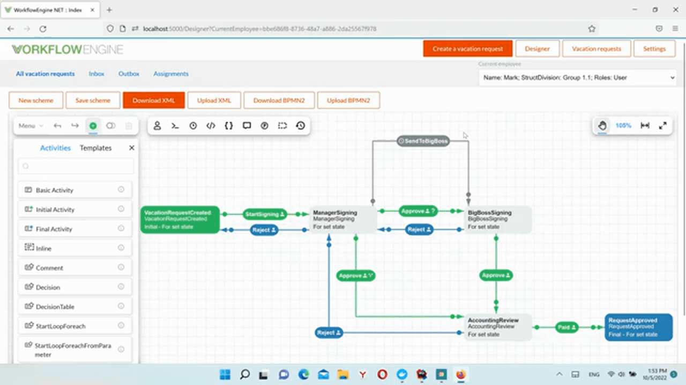

## WorkflowEngine.NET

[https://workflowengine.io](https://workflowengine.io)

Email: [support@optimajet.com](mailto:support@optimajet.com)

---

WorkflowEngine.NET - component that adds workflow in your application. It can be fully integrated into your application, or be in the form
of a specific service (such as a web service).

Steps for include the engine into your project: https://workflowengine.io/documentation/how-to-integrate/

### Features

- Process scheme generation in runtime
- Designer of process scheme
- Changing process scheme in runtime is possible
- Pre-execution of process (executing of a process from initial activity to final activity without changing state)
- Simple version control and upgrade of process scheme
- Serialization and saving of parameters on demand
- Support SQL/NoSQL databases

**Workflow Engine NET includes a html5 designer:**

### Demo

### Samples

We have samples with MS SQL, MongoDB, MySQL, Oracle, PostgreSQL, Redis. Check out [Samples](Samples).

**Official web site** &mdash; [https://workflowengine.io](https://workflowengine.io)

**Documentation** &mdash; [https://workflowengine.io/documentation](https://workflowengine.io/documentation)

**Designer** &mdash; [https://demo.workflowengine.io/designer](https://demo.workflowengine.io/designer)

**Demo** &mdash; [https://demo.workflowengine.io/](https://demo.workflowengine.io/)

For technical questions, please contact [support@optimajet.com](mailto:support@optimajet.com).

For commercial use, please contact [sales@optimajet.com](mailto:sales@optimajet.com).

**Free limits:**

- Activity: 15
- Transition: 25
- Command: 5
- Schema: 1
- Thread: 1
